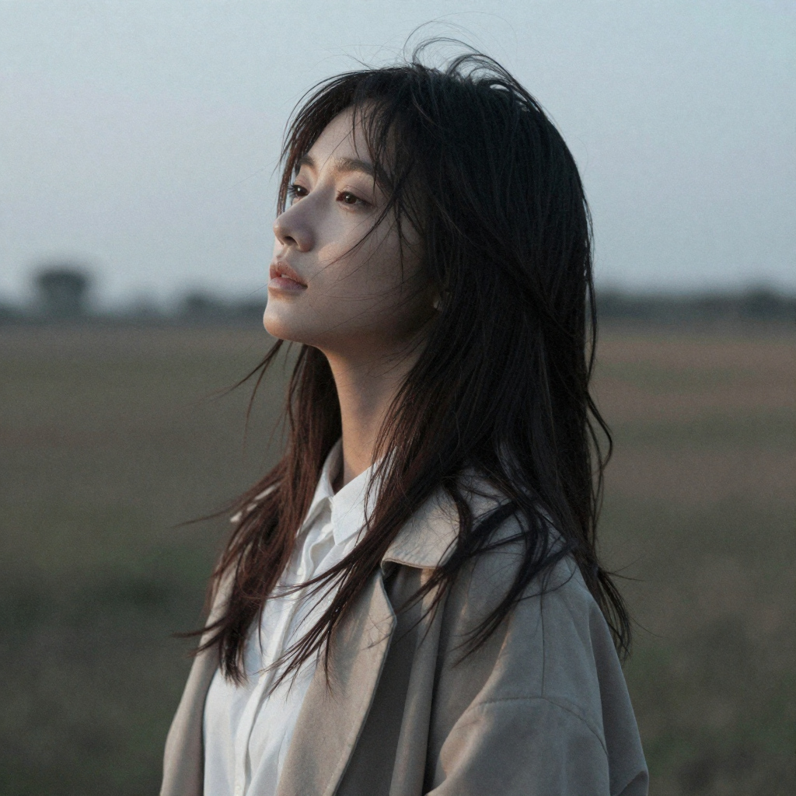
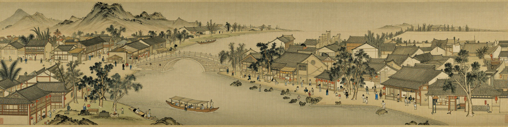

# Z-Image ncnn Vulkan

:exclamation: :exclamation: :exclamation: This software is in the early development stage, it may bite your cat

ncnn implementation of Z-Image image generater.

zimage-ncnn-vulkan uses [ncnn project](https://github.com/Tencent/ncnn) as the universal neural network inference framework.

## About Z-Image

Z-Image: An Efficient Image Generation Foundation Model with Single-Stream Diffusion Transformer

https://github.com/Tongyi-MAI/Z-Image

## Usages

### requirements

- Minimum: 16GB RAM, 1GB Vulkan integrated GPU
- Recommended: 32GB RAM, 16GB Vulkan dedicated GPU with tencorcore/matrix hardware

### prepare model files

https://huggingface.co/nihui-szyl/z-image-ncnn/tree/main/z-image-turbo

https://huggingface.co/nihui-szyl/z-image-ncnn/tree/main/z-image

### Example Command

```shell
zimage-ncnn-vulkan.exe -p "風的彷徨." -o output.png
```

### Full Usages

```console
Usage: zimage-ncnn-vulkan -p prompt -o outfile [options]...

  -h                   show this help
  -p prompt            prompt (default=rand)
  -n negative-prompt   negative prompt (optional)
  -o output-path       output image path (default=out.png)
  -s image-size        image resolution (default=1024,1024)
  -l steps             denoise steps (default=9)
  -r random-seed       random seed (default=rand)
  -g gpu-id            gpu device to use (-1=cpu, default=auto)
```

If you encounter a crash or error, try upgrading your GPU driver:

- Intel: https://downloadcenter.intel.com/product/80939/Graphics-Drivers
- AMD: https://www.amd.com/en/support
- NVIDIA: https://www.nvidia.com/Download/index.aspx

## Build from Source

1. Clone this project with all submodules

```shell
git clone https://github.com/nihui/zimage-ncnn-vulkan.git
cd zimage-ncnn-vulkan
git submodule update --init --recursive --depth 1
```

2. Build with CMake

```shell
mkdir build
cd build
cmake ../src
cmake --build . -j 4
```

## Sample Images

<table width="100%">
<tr>
<td width="50%">

<details>
<summary>expand for full command</summary>

```zimage-ncnn-vulkan.exe -p "A half-length portrait in the warm light of a convenience store late at night. An East Asian beauty, holding milk, meets your gaze in front of the freezer." -r 2065820720```

</details>


</td>
<td width="50%">

<details>
<summary>expand for full command</summary>

```zimage-ncnn-vulkan.exe -p "A Suzhou garden at night under a bright autumn moon, silvery light bathing the pavilions and rocks, paper lanterns glowing warmly along the corridors, the pond reflecting the moon and lantern light, cool color palette with accents of warmth, mysterious and poetic atmosphere." -r 1593388185```

</details>


</td>
</tr>
<tr>
<td width="50%">

<details>
<summary>expand for full command</summary>

```zimage-ncnn-vulkan.exe -p "Cinnamoroll, Sanrio character, white puppy with long floppy ears, blue eyes, chubby cheeks, plump tail like a cinnamon roll, simple blue bow on right ear, high-quality anime figure, prize figure style, seamless joints, glossy paint finish, detailed sculpting, sitting pose with head tilted, innocent expression, standing on a fluffy cloud-shaped display base, soft gradient pastel background, studio lighting, product photography, sharp focus, shallow depth of field" -r 1362178531```

</details>


</td>
<td width="50%">

<details>
<summary>expand for full command</summary>

```zimage-ncnn-vulkan.exe -p "a cute girl taking a mirror selfie, full-body view in a full-length mirror, holding a large smartphone in front of her face, the phone screen is visible and glowing, slightly obscuring her eyes or lower face, long twin tails, soft makeup, blush, wearing a trendy and cute outfit, in a cozy, clean bedroom with soft lighting, mirror may have a decorative frame, shallow depth of field, digital photo style, cinematic lighting, sharp focus on the phone and reflection, natural skin texture, Instagram aesthetic, candid feeling" -r 2029158043```

</details>


</td>
</tr>
</table>

<table width="100%">
<tr>
<td width="33%">

<details>
<summary>expand for full command</summary>

```zimage-ncnn-vulkan.exe -p "風的彷徨." -r 77```

</details>



</td>
<td width="33%">

<details>
<summary>expand for full command</summary>

```zimage-ncnn-vulkan.exe -p "風的彷徨." -r 777```

</details>


</td>
<td width="34%">

<details>
<summary>expand for full command</summary>

```zimage-ncnn-vulkan.exe -p "Anya Forger hugging a large white dog (Bond), both looking happy, in a park, sunny day, grass field, action shot, from Spy x Family" -r 499008670```

</details>


</td>
</tr>

<tr>
<td width="100%" colspan=3>

<details>
<summary>expand for full command</summary>

```zimage-ncnn-vulkan.exe -p "traditional Chinese handscroll painting in the style of “清明上河图”, horizontal panorama, bustling riverside cityscape in Northern Song Dynasty, Bianliang city, with Rainbow Bridge at the center, boats on the river, shops along the street, teahouses, inns, hundreds of diverse people engaged in daily activities, travelers, merchants, scholars, entertainers, children playing, ink and color on silk, fine brushwork for architecture and figures, subtle expressive brushwork for trees and landscape, soft natural colors, high aerial viewpoint, continuous narrative, lively, prosperous, detailed, harmonious, capturing a complete day of city life, extremely wide aspect ratio, vanishing perspective, Chinese seals and calligraphy on the margins, slight aged paper texture" -r 1321390901 -s 2048,512```

</details>



</td>
</tr>
</table>

## Original Z-Image Project

- https://github.com/Tongyi-MAI/Z-Image

## Other Open-Source Code Used

- https://github.com/Tencent/ncnn for fast neural network inference on ALL PLATFORMS
- https://github.com/futz12/ncnn_llm for BPE tokenizer
- https://github.com/webmproject/libwebp for encoding and decoding Webp images on ALL PLATFORMS
- https://github.com/libjpeg-turbo/libjpeg-turbo for encoding and decoding JPEG images on ALL PLATFORMS
- https://github.com/pnggroup/libpng for encoding and decoding PNG images on ALL PLATFORMS
- https://github.com/zlib-ng/zlib-ng for encoding and decoding PNG images on ALL PLATFORMS
- https://github.com/tronkko/dirent for listing files in directory on Windows
